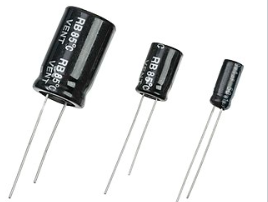

# Blue Noise


### Open-source Wireless Jamming Pentesting Device using ESP32-WROOM-32D & 2 NRFL01+PA+LNA Modules

### Designed to also work with a flipper zero, and has some extra pins to add other modules!

### Part of the exhibtion : https://weltecho.eu/veranstaltung/vernissage-28/


 ---
# WHAT DOES IT DO?

**IT CREATES NOISE SIGNAL TO JAM BLUETOOTH AND WIFI USING NRF24L01 AND ESP32 IN RANGE 2.4GHZ DEVICES , EFFECTS MAY VARY DEPENDS ON DEVICE BLUETOOTH VERSIONS....WARNING!!! JAMMING IS ILLEGAL**

---
## REQUIRED DEVICE AND MODULE:
1. `NRF24L01+ PLUS – PA LNA SMA Antenne`
-  

2. `1pc ESP32` NOTE... YOU CAN USE A `NANO OR MICRO` BUT ESP32 ARE CHEAP ALMOST SAME PRICE AS `ARDUINOS`...LOL
- 

3. `10UF-100UF CAPACITOR DEPEND ON YOUR NRF` 
- 

4. `1 DIP SWITCH` (OPTIONAL IF YOU WANT TO USE DIFFERENT PATTERN OF CHANNEL HOPPING)
- 

5. `Lithium Polymer Battery 3.7V 1100mAh` 
- 

6. `Type-C USB 5V 1A 18650 Lithium Battery Charger Module` 
- 

7. `DC Step Up Converter, 3.7 V to 5 V 8 V 9 V 12 V` 
- 


---


 ## PINS TO ATTACH NRF24L01 TO ESP32

### FOR DUAL/TWO NRF24L01 
+ ` HSPI= SCK = 14, MISO = 12, MOSI = 13, CS = 15 , CE = 16`
+ ` VSPI= SCK = 18, MISO =19, MOSI = 23 ,CS =21 ,CE = 22`

### FOR SINGLE/ONE NRF24L01 YOU CAN CHOOSE BETWEEN HSPI OR VSPI 
 - `VSPI= SCK = 18, MISO =19, MOSI = 23 ,CS =21 ,CE = 22`
- `HSPI= SCK = 14, MISO = 12, MOSI = 13, CS = 15 , CE = 16` 

### SWITCH PIN (OPTIONAL)
- `PIN 33 OF YOUR ESP32 `
---
## WIRING DIAGRAM


### NRF24L01 PINS
- ![NRF24L01 PIN]

### ESP32 PINS WHERE YOU ATTACH YOUR `NRF24` AND `SWITCH `
- ![32]


### HOW YOU ATTACH CAPACITOR LOOK OUT FOR POLAROITY SIGNS `- +`
- ![NRF24 CAPACITOR]

### Wiring


--- 

## UPLOADING CODE TO ESP32

- ` WEBFLASHER `INSTALLER FOR EASY UPLOAD CODE ON ESP32 NO NEED TO DOWNLOAD INO FILE (USE CHROME OR MICROSOFT BROWSER)

 [WEBFLASHER](https://simonweckert.com/au5st3llung/COCO/flash/bluenoise/index.html) HERE....SELECT WHAT TO UPLOAD `VSPI,HSPI OR DUAL` AND CHOOSE RIGHT `COM PORT`


---


## DEMO


+ **TESTED 10 METERS ON BLUETOOTH 5.0 AND WORKS GREAT**
+ **TESTED 10 METERS ON NEWER BLUETOOTH 5.3 WORKING DEPENDS BETWEEN THE GAP OF BLUETOOTH DEVICE AND PHONE**

---

## COMPILING USING IDE (IF YOUR NOT USING WEBFLASHER)

* DOWNLOAD LIBRARIES YOU NEED AND INSTALL [RF24 LIBRARY](https://github.com/nRF24/RF24) AND [EZBUTTON LIBRARY](https://arduinogetstarted.com/tutorials/arduino-button-library)
* DOWLOAD CODE [INO FILE](https://github.com/smoochiee/Ble-jammer/tree/main/INO)

---


## SOME NOTES

* NRF24 CAN DO 125 CHANNELS YOU CAN EDIT IT IN CODE
- BLUETOOTH CLASSIC 80 CHANNELS
+ BLE USES 40 CHANNELS
* WIFI USES 1-14 CHANNELS
* DRONE 2.4GHZ 1-125 SO YOU NEED TO EDIT CODE TO HOPE 125 CHANNELS
* YOU CAN EDIT PAYLOAD SIZE DIRECTLY ON RF24 LIBRARY  `RF24.CPP LINE # 1972`
```
/****************************************************************************/
void RF24::startConstCarrier(rf24_pa_dbm_e level, uint8_t channel)
{
    stopListening();
    write_register(RF_SETUP, read_register(RF_SETUP) | _BV(CONT_WAVE) | _BV(PLL_LOCK));
    if (isPVariant()) {
        setAutoAck(0);
        setRetries(0, 0);
        uint8_t dummy_buf[5];
        for (uint8_t i = 0; i < 5; ++i)
            dummy_buf[i] = 0x00;

        // use write_register() instead of openWritingPipe() to bypass
        // truncation of the address with the current RF24::addr_width value
        write_register(TX_ADDR, reinterpret_cast<uint8_t*>(&dummy_buf), 5);
        flush_tx(); // so we can write to top level

        // use write_register() instead of write_payload() to bypass
        // truncation of the payload with the current RF24::payload_size value
        write_register(W_TX_PAYLOAD, reinterpret_cast<const uint8_t*>(&dummy_buf), 5);

        disableCRC();
    }
    setPALevel(level);
    setChannel(channel);
    IF_SERIAL_DEBUG(printf_P(PSTR("RF_SETUP=%02x\r\n"), read_register(RF_SETUP)));
    ce(HIGH);
    if (isPVariant()) {
        delay(1); // datasheet says 1 ms is ok in this instance
        ce(LOW);
        reUseTX();
    }
}

/****************************************************************************/

```


# SPECIAL THANKS
  * [ATOMNFT](https://github.com/dkyazzentwatwa/cypher-jammer?tab=readme-ov-file) - Cypher Jammer

